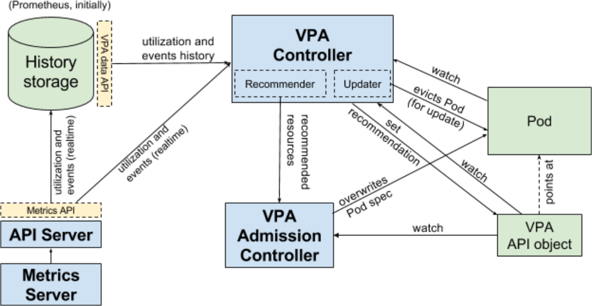

[](https://circleci.com/gh/giantswarm/vertical-pod-autoscaler-app)

# vertical-pod-autoscaler-app chart

Giant Swarm offers a vertical-pod-autoscaler Managed App which can be installed in workload clusters.
Here we define the vertical-pod-autoscaler chart with its templates and default configuration.

You should read [upstream documentation](https://github.com/kubernetes/autoscaler/tree/master/vertical-pod-autoscaler), but here is an overview.

## Architecture overview



(credit: [upstream design proposal](https://github.com/kubernetes/design-proposals-archive/blob/main/autoscaling/vertical-pod-autoscaler.md#architecture-overview))


## basic syntax

You can create a `verticalpodautoscaler` or `vpa` resource that will monitor/update other resources in the same namespace.

Syntax looks like this:

```
apiVersion: autoscaling.k8s.io/v1
kind: VerticalPodAutoscaler
metadata:
  name: fluent-logshipping-app
  namespace: monitoring
spec:
  resourcePolicy:
    containerPolicies:
    - containerName: fluent-bit
      controlledResources:
      - memory
      maxAllowed:
        memory: 500Mi
      minAllowed:
        memory: 100Mi
      mode: Auto
  targetRef:
    apiVersion: apps/v1
    kind: DaemonSet
    name: fluent-logshipping-app
  updatePolicy:
    updateMode: Auto
```

This one will look for `fluent-bit` containers from the `fluent-logshipping-app` DaemonSet, and will act on memory.
It will automatically adjust the pod's memory `requests` between `100Mi` and `500Mi`.


## Common pitfalls

### VPA sets the container's requests

The container's limits will be defined according to its original ratio.

Let's see it with an example:
* my original fluentbit pod was set with `requests: 200Mi` and `limits: 300Mi`.
* VPA increases it to `requests: 400Mi`, it also sets `limits: 600Mi`.
* Notice that now the RAM limit is higher than the VPA's `maxAllowed`.

### Containers grow bigger than available resources

There's 2 things that you may aim for with VPA:
- make sure your container has enough resources to work (`requests` management)
- make sure your container fits on your nodes (`limits` management)

When a container uses too much resources, keep in mind that [VPA sets the container's requests](#vpa-sets-the-containers-requests) and that `limits` are set proportionally.

If you want to make sure your container won't use more resources than `maxAllowed`, set `limits`=`requests` at container creation.

## Credit

* https://github.com/kubernetes/autoscaler
